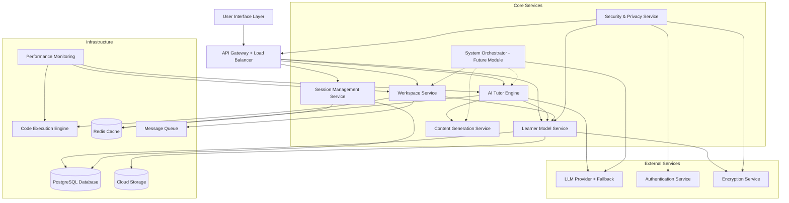
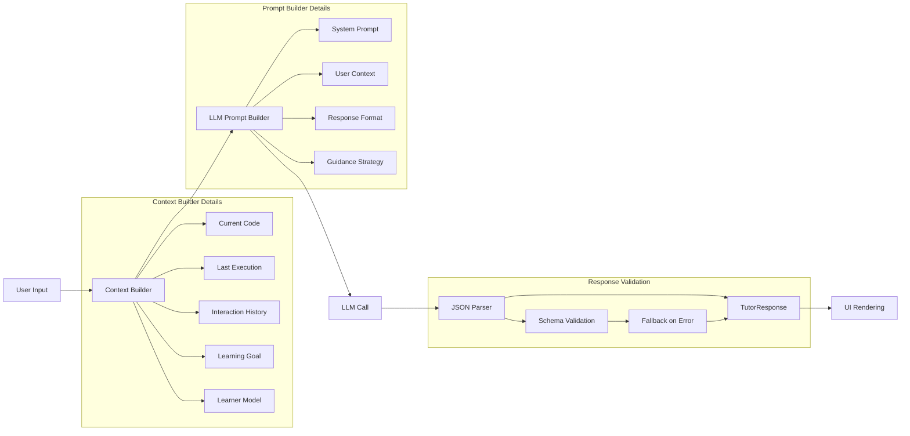

# Technical Design Document

## Overview

The Adaptive Learning Workspace is a sophisticated AI-powered educational platform that transforms technical learning from passive consumption to active discovery. The system creates dynamic, personalized learning environments where users solve problems while receiving contextual guidance from an intelligent tutor that adapts in real-time to their learning patterns.

### Core Philosophy

Rather than delivering static content, the platform functions as an intelligent tutor that:
- Guides learners through questioning and hints instead of direct answers
- Adapts teaching strategies based on individual learning patterns and error analysis
- Creates personalized problem-solving environments with progressive feature unlocking
- Maintains persistent, cloud-synced learner models that evolve with user progress
- Ensures privacy compliance while enabling personalized learning experiences

### Key Capabilities

- **Goal-Based Learning**: Customized environments based on specific learning objectives with prerequisite validation
- **Interactive Workspace**: Real-time code execution with 2-second response targets and Python-first language support
- **Adaptive AI Tutor**: Dynamic guidance with structured JSON responses and 3-second performance targets
- **Persistent Learning**: Cross-session progress tracking with cloud synchronization and per-account persistence
- **Context Awareness**: Tutor responses tied to current user activity with comprehensive session context
- **Progressive Complexity**: Content difficulty scaling with automatic feature unlocking based on proficiency milestones
- **Error-Driven Learning**: Comprehensive error classification system (Syntax, Runtime, Logical, Conceptual) with pattern analysis
- **Security & Privacy**: GDPR-compliant data handling with encryption, consent management, and user data control

## Architecture

### High-Level Architecture

The system follows a microservices architecture with clear separation between the AI tutoring engine, workspace execution environment, and user interface components. The architecture is designed to meet strict performance requirements (3-second AI responses, 2-second code execution) while maintaining security and scalability.

**Core Vision**: This platform serves as the foundation for an AI System Builder that can generate complete development environments, not just tutoring experiences. The current implementation focuses on adaptive learning as the first use case, with the architecture designed to support future system generation capabilities.



### Performance Architecture

**Response Time Targets**
- AI Tutor responses: ≤ 3 seconds (with progress indicators for longer operations)
- Code execution: ≤ 2 seconds (with timeout handling)
- UI interactions: ≤ 500ms (with optimistic updates)
- Auto-save operations: ≤ 1 second (background processing)

**Scalability Strategy**
- Horizontal scaling for stateless services (Tutor Engine, Content Generation)
- Connection pooling and caching for database operations
- CDN distribution for static assets and common responses
- Load balancing with health checks and circuit breakers

### Service Responsibilities

**AI Tutor Engine**
- Analyzes user input and context to generate structured JSON guidance
- Implements interaction pipeline with diagnosis, hint, question, and next_step fields
- Adapts teaching strategies based on learner model data and error patterns
- Manages progression logic with 80% success rate thresholds for difficulty scaling
- Provides fallback responses when LLM services fail

**Workspace Service**
- Manages Python-first code editing environment with extensibility architecture
- Handles syntax highlighting, autocomplete, and real-time validation
- Coordinates with execution engine for sub-2-second code running
- Tracks user activity and implements continuous auto-save functionality
- Manages progressive feature unlocking based on proficiency milestones

**Learner Model Service**
- Maintains persistent, cloud-synced user profiles with per-account data isolation
- Stores learning patterns, comprehensive error analysis, and performance metrics
- Provides real-time personalization data to other services
- Handles GDPR-compliant data privacy, consent management, and user data control
- Implements secure data export and deletion capabilities

**Content Generation Service**
- Dynamically creates exercises using AI generation with curated fallback content
- Validates generated content for correctness and educational value
- Maintains exercise effectiveness tracking and engagement metrics
- Provides content appropriate for user skill level and learning objectives
- Implements content caching for performance optimization

**Session Management Service**
- Handles continuous auto-save of user code and learning state
- Manages session persistence across interruptions and system maintenance
- Coordinates state restoration and session continuity
- Implements graceful degradation during system failures
- Tracks session analytics and user engagement patterns

**Security & Privacy Service**
- Implements AES-256 encryption for all stored user data
- Manages user consent and data usage policies
- Provides secure authentication and session management
- Handles data anonymization for system improvement
- Ensures GDPR and CCPA compliance for user privacy rights

### System Generation / Orchestrator (Future Module)

**Vision**: The System Orchestrator represents the evolution from AI Tutor Platform to AI System Builder. This module will enable users to specify high-level system requirements and automatically generate complete development environments, applications, and learning experiences.

**System Orchestrator Service**
- Parses natural language system specifications into structured requirements
- Generates complete system architectures including services, databases, and UI components
- Orchestrates the creation of development environments, codebases, and deployment configurations
- Integrates with existing services to create specialized systems (learning platforms, business applications, etc.)
- Provides system evolution capabilities as requirements change over time

#### Key Components

**Intent Parser**
```typescript
interface SystemOrchestrator {
  parseIntent(userInput: string): Promise<SystemIntent>
  generateComponents(intent: SystemIntent): Promise<SystemPlan>
  executeGeneration(plan: SystemPlan): Promise<GeneratedSystem>
  validateSystem(system: GeneratedSystem): Promise<ValidationResult>
}

interface SystemIntent {
  systemType: 'learning_platform' | 'business_app' | 'api_service' | 'data_pipeline'
  requirements: string[]
  constraints: SystemConstraint[]
  targetUsers: UserProfile[]
  technicalPreferences: TechStack
}

interface SystemPlan {
  architecture: ArchitectureSpec
  components: ComponentSpec[]
  dataModels: DataModelSpec[]
  userInterfaces: UISpec[]
  deploymentConfig: DeploymentSpec
  estimatedComplexity: number
}

interface GeneratedSystem {
  codebase: FileStructure
  documentation: SystemDocumentation
  tests: TestSuite
  deployment: DeploymentArtifacts
  monitoring: MonitoringConfig
}
```

**Component Generation Engine**
- **Service Generation**: Creates microservices with proper interfaces and business logic
- **Database Schema Generation**: Designs optimal database structures for system requirements
- **UI Generation**: Creates responsive user interfaces tailored to user workflows
- **API Generation**: Builds RESTful and GraphQL APIs with proper documentation
- **Test Generation**: Produces comprehensive test suites including unit, integration, and end-to-end tests

**Integration with Current Platform**
The current AI Tutor Engine serves as the first specialized system generated by this orchestrator. Future capabilities include:
- **Business Applications**: CRM, inventory management, project tracking systems
- **Educational Platforms**: Specialized learning environments for different domains
- **Data Processing Systems**: ETL pipelines, analytics dashboards, reporting systems
- **API Services**: Microservices for specific business domains with full CRUD operations

## Components and Interfaces

### AI Tutor Engine

The core intelligence of the system, responsible for providing adaptive guidance and maintaining educational quality.

#### Key Components

**Interaction Pipeline**
```typescript
interface InteractionPipeline {
  analyzeUserInput(input: UserInput, context: SessionContext): Promise<Analysis>
  generateGuidance(analysis: Analysis, learnerModel: LearnerModel): Promise<TutorResponse>
  validateResponse(response: TutorResponse): Promise<boolean>
}

interface TutorResponse {
  diagnosis: string
  hint: string
  question: string
  next_step: string
  guidance_strategy: GuidanceStrategy
}
```

#### Interaction Pipeline State Flow

The following diagram shows the explicit flow of data through the AI Tutor interaction pipeline:



**Pipeline State Management**
- **Context Builder**: Aggregates current session state, code, execution results, and learner model data
- **Prompt Builder**: Constructs structured prompts with system instructions, user context, and response format requirements
- **LLM Call**: Executes the language model request with fallback handling and timeout management
- **JSON Parser**: Validates and parses structured responses, with error recovery and fallback mechanisms
- **UI Rendering**: Presents the structured response in the tutor panel with appropriate formatting

**LLM Integration Layer**
```typescript
interface LLMService {
  generateResponse(prompt: PromptTemplate, context: SessionContext): Promise<LLMResponse>
  parseStructuredOutput(response: string): Promise<TutorResponse>
  handleFallback(error: LLMError, context: SessionContext): Promise<TutorResponse>
}

interface PromptTemplate {
  systemPrompt: string
  userContext: string
  learnerModel: LearnerModelSummary
  responseFormat: ResponseSchema
}

interface LLMResponse {
  content: string
  model: string
  tokens: number
  latency: number
  confidence: number
}
```

**Model Selection and Prompt Construction**
- **Primary Model**: GPT-4 for complex reasoning and guidance generation
- **Fallback Models**: GPT-3.5-turbo, Claude-3-Sonnet for redundancy
- **System Prompt Structure**:
  ```
  Role: Expert programming tutor using Socratic method
  Guidelines: Guide through questions, avoid direct solutions
  Context: {current_code, learning_goal, error_history}
  Output Format: Strict JSON with diagnosis/hint/question/next_step
  ```
- **Structured JSON Enforcement**: 
  - JSON schema validation on all responses
  - Retry mechanism with format correction prompts
  - Fallback to template responses if parsing fails

**Guidance Strategy Engine**
```typescript
interface GuidanceStrategy {
  type: 'questioning' | 'hinting' | 'explaining' | 'challenging'
  intensity: number // 1-10 scale
  adaptationTriggers: AdaptationTrigger[]
}

interface AdaptationTrigger {
  condition: string
  newStrategy: GuidanceStrategy
  confidence: number
}
```

**Error Analysis System**
```typescript
interface ErrorAnalyzer {
  classifyError(error: ExecutionError, code: string): ErrorClassification
  identifyPatterns(errors: ExecutionError[], learnerHistory: LearnerHistory): ErrorPattern[]
  generateGuidance(classification: ErrorClassification, context: SessionContext): TutorResponse
}

enum ErrorType {
  SYNTAX = 'syntax',
  RUNTIME = 'runtime', 
  LOGICAL = 'logical',
  CONCEPTUAL = 'conceptual'
}
```

### End-to-End Interaction Example

**Scenario**: User goal "learn Python for loops" → exercise generation → user error → error analysis → structured tutor response

**Step 1: Goal Processing**
```json
{
  "user_input": "I want to learn Python for loops",
  "processed_goal": {
    "concept": "iteration_control",
    "language": "python",
    "difficulty": 1,
    "prerequisites": ["variables", "basic_syntax"]
  }
}
```

**Step 2: Exercise Generation**
```json
{
  "exercise": {
    "title": "Print Numbers 1 to 5",
    "description": "Write a for loop that prints numbers from 1 to 5",
    "starter_code": "# Write your for loop here\n",
    "expected_output": "1\n2\n3\n4\n5\n"
  }
}
```

**Step 3: User Code with Error**
```python
for i in range(5):
    print(i)
```

**Step 4: Error Analysis**
```json
{
  "execution_result": {
    "output": "0\n1\n2\n3\n4\n",
    "expected": "1\n2\n3\n4\n5\n",
    "error_type": "logical"
  },
  "error_classification": {
    "type": "off_by_one",
    "concept_gap": "range_function_behavior",
    "severity": "minor"
  }
}
```

**Step 5: Structured Tutor Response**
```json
{
  "diagnosis": "Your loop runs correctly but prints 0-4 instead of 1-5. This is a common range() function misunderstanding.",
  "hint": "The range() function starts at 0 by default. Consider what parameters range() accepts.",
  "question": "What do you think range(5) actually generates? Try printing each value to see.",
  "next_step": "Experiment with range(1, 6) or range(5) and observe the difference in output.",
  "guidance_strategy": {
    "type": "questioning",
    "intensity": 3
  }
}
```

### Workspace Service

Manages the interactive coding environment with real-time execution capabilities.

#### Key Components

**Code Execution Manager**
```typescript
interface CodeExecutionManager {
  executeCode(code: string, language: string): Promise<ExecutionResult>
  validateCode(code: string, language: string): Promise<ValidationResult>
  getExecutionEnvironment(userId: string): Promise<ExecutionEnvironment>
}

interface ExecutionResult {
  output: string
  errors: ExecutionError[]
  executionTime: number
  memoryUsage: number
  success: boolean
}
```

**Security and Sandboxing**
The system uses **Docker containers** for secure code execution:
- **Container Technology**: Docker with Alpine Linux base images
- **Resource Limits**: 128MB RAM, 1 CPU core, 2-second timeout
- **Network Isolation**: No external network access from execution containers
- **File System**: Read-only base system with writable /tmp limited to 10MB
- **Process Limits**: Maximum 10 processes per container
- **Security Profiles**: AppArmor/SELinux profiles restricting system calls
- **Container Lifecycle**: Fresh container per execution, automatic cleanup after 5 minutes

**Performance Optimization for 2-Second Target**:
- **Container Pool**: Pre-warmed containers ready for immediate use
- **Image Caching**: Cached Python runtime images for instant startup
- **Execution Queue**: Prioritized queue with load balancing across execution nodes
- **Resource Monitoring**: Real-time tracking to prevent resource exhaustion

**Workspace State Manager**
```typescript
interface WorkspaceState {
  userId: string
  sessionId: string
  currentCode: string
  lastExecution: ExecutionResult
  activeGoal: LearningGoal
  unlockedFeatures: Feature[]
  autoSaveTimestamp: Date
}

interface Feature {
  id: string
  name: string
  description: string
  unlockCriteria: UnlockCriteria
  enabled: boolean
}
```

### Learner Model Service

Maintains comprehensive user profiles with privacy-compliant data management.

#### Key Components

**Learner Profile**
```typescript
interface LearnerModel {
  userId: string
  learningGoals: LearningGoal[]
  knowledgeMap: KnowledgeMap
  learningPatterns: LearningPattern[]
  errorHistory: ErrorHistory
  performanceMetrics: PerformanceMetrics
  preferences: UserPreferences
  consentSettings: ConsentSettings
}

interface KnowledgeMap {
  concepts: Map<string, ConceptMastery>
  skills: Map<string, SkillLevel>
  prerequisites: Map<string, string[]>
}

interface ConceptMastery {
  conceptId: string
  masteryLevel: number // 0-1 scale
  lastAssessed: Date
  confidenceScore: number
  practiceCount: number
}
```

**Progress Tracking**
```typescript
interface ProgressTracker {
  updateProgress(userId: string, activity: LearningActivity): Promise<void>
  calculateMastery(userId: string, conceptId: string): Promise<number>
  identifyGaps(userId: string, targetGoal: LearningGoal): Promise<ConceptualGap[]>
  recommendNextSteps(userId: string): Promise<Recommendation[]>
}
```

#### Learner Model Update Logic

The system uses concrete algorithms to update learner models based on user interactions:

**Mastery Level Updates**
```typescript
interface MasteryUpdateRules {
  // Success increases mastery
  onSuccess: (current: number, difficulty: number) => number
  // Errors decrease mastery based on error type
  onError: (current: number, errorType: ErrorType, attempts: number) => number
  // Time-based decay for unused concepts
  onTimeDecay: (current: number, daysSinceLastPractice: number) => number
}

// Concrete update algorithms
const masteryUpdates = {
  onSuccess: (current, difficulty) => {
    const increment = 0.1 * difficulty * (1 - current) // Diminishing returns
    return Math.min(1.0, current + increment)
  },
  
  onError: (current, errorType, attempts) => {
    const penalties = {
      'syntax': 0.02,     // Minor penalty for syntax errors
      'runtime': 0.05,    // Moderate penalty for runtime errors  
      'logical': 0.08,    // Higher penalty for logical errors
      'conceptual': 0.15  // Significant penalty for conceptual errors
    }
    const penalty = penalties[errorType] * Math.min(attempts, 3) // Cap at 3 attempts
    return Math.max(0.0, current - penalty)
  },
  
  onTimeDecay: (current, days) => {
    const decayRate = 0.01 // 1% per day
    const decay = decayRate * days
    return Math.max(0.0, current - decay)
  }
}
```

**Adaptation Algorithm Examples**
```typescript
// Example: User makes a logical error in a loop
const updateExample = {
  before: { masteryLevel: 0.75, conceptId: 'python_loops' },
  error: { type: 'logical', attempts: 2 },
  calculation: 0.75 - (0.08 * 2), // 0.75 - 0.16 = 0.59
  after: { masteryLevel: 0.59, conceptId: 'python_loops' }
}

// Example: User successfully completes advanced exercise
const successExample = {
  before: { masteryLevel: 0.60, conceptId: 'python_functions' },
  success: { difficulty: 3 }, // Advanced difficulty
  calculation: 0.60 + (0.1 * 3 * (1 - 0.60)), // 0.60 + 0.12 = 0.72
  after: { masteryLevel: 0.72, conceptId: 'python_functions' }
}
```

**Strategy Adaptation Rules**
```typescript
interface StrategyAdaptation {
  // Switch to more explanatory approach when user struggles
  onRepeatedErrors: (errorCount: number, errorType: ErrorType) => GuidanceStrategy
  // Switch to questioning when user shows understanding
  onConsistentSuccess: (successRate: number, timeToComplete: number) => GuidanceStrategy
  // Adjust intensity based on user response patterns
  onUserFeedback: (responseTime: number, helpRequests: number) => GuidanceStrategy
}

const strategyRules = {
  onRepeatedErrors: (errorCount, errorType) => {
    if (errorCount >= 3 && errorType === 'conceptual') {
      return { type: 'explaining', intensity: 7 } // High-intensity explanation
    }
    if (errorCount >= 2) {
      return { type: 'hinting', intensity: 6 } // Stronger hints
    }
    return { type: 'questioning', intensity: 4 } // Default questioning
  },
  
  onConsistentSuccess: (successRate, avgTime) => {
    if (successRate > 0.8 && avgTime < 120) { // 80% success, under 2 minutes
      return { type: 'challenging', intensity: 8 } // Increase difficulty
    }
    return { type: 'questioning', intensity: 5 } // Continue questioning
  }
}
```

### Content Generation Service

Dynamically creates and manages educational content with quality assurance.

#### Key Components

**Exercise Generator**
```typescript
interface ExerciseGenerator {
  generateExercise(goal: LearningGoal, difficulty: number, context: LearnerContext): Promise<Exercise>
  validateExercise(exercise: Exercise): Promise<ValidationResult>
  getCuratedExercise(goal: LearningGoal, difficulty: number): Promise<Exercise>
}

interface Exercise {
  id: string
  title: string
  description: string
  starterCode: string
  expectedOutput: string
  hints: string[]
  difficulty: number
  concepts: string[]
  validationCriteria: ValidationCriteria[]
}
```

**ValidationPipeline**
```typescript
interface ValidationPipeline {
  executeTestCases(exercise: Exercise, solution: string): Promise<TestResult[]>
  verifySolution(exercise: Exercise, userCode: string): Promise<SolutionVerification>
  calibrateDifficulty(exercise: Exercise, userPerformance: PerformanceData[]): Promise<DifficultyCalibration>
}

interface TestResult {
  testCase: string
  input: any
  expectedOutput: any
  actualOutput: any
  passed: boolean
  executionTime: number
  errorMessage?: string
}

interface SolutionVerification {
  isCorrect: boolean
  passedTests: number
  totalTests: number
  codeQuality: CodeQualityMetrics
  conceptsApplied: string[]
  suggestions: string[]
}

interface DifficultyCalibration {
  currentDifficulty: number
  suggestedDifficulty: number
  reasoning: string
  confidenceScore: number
}
```

#### Content Generation Risk Mitigation

**Quality Assurance Constraints**
- **Mandatory Verification**: At least 1 verified solution must pass all test cases before serving any exercise to users
- **Multi-Solution Validation**: Generated exercises must have at least 2 different valid solution approaches verified
- **Edge Case Testing**: All exercises must pass validation against edge cases (empty inputs, boundary values, error conditions)
- **Concept Alignment**: Generated content must demonstrably teach the intended concept through static analysis verification

**AI-Generated Content Quality Controls**
```typescript
interface ContentQualityGate {
  // Minimum requirements before serving content
  verifiedSolutions: number // Must be >= 1
  testCaseCoverage: number  // Must be >= 90%
  conceptAlignment: number  // Must be >= 0.8
  difficultyCalibration: number // Must be within ±0.5 of target
}

const qualityThresholds = {
  verifiedSolutions: 1,      // At least 1 working solution required
  testCaseCoverage: 0.90,    // 90% test case coverage minimum
  conceptAlignment: 0.80,    // 80% concept alignment score
  difficultyCalibration: 0.5 // Within 0.5 difficulty points of target
}
```

**Fallback Content Strategy**
- **Curated Exercise Bank**: Manually verified exercises for core concepts serve as fallback when AI generation fails quality gates
- **Progressive Fallback**: System attempts AI generation → curated content → simplified version → error state with user notification
- **Quality Monitoring**: Real-time tracking of exercise effectiveness with automatic removal of low-performing content

**Python Exercise Validation**
For Python exercises, validation works through:
1. **Syntax Validation**: AST parsing to ensure code is syntactically correct
2. **Test Case Execution**: Running user code against predefined test cases in isolated environment
3. **Output Comparison**: Comparing actual vs expected outputs with tolerance for formatting differences
4. **Concept Verification**: Static analysis to ensure required concepts (loops, functions, etc.) are used
5. **Performance Validation**: Checking execution time and memory usage within acceptable bounds
```

## Data Models

### Core Domain Models

**Learning Goal**
```typescript
interface LearningGoal {
  id: string
  title: string
  description: string
  category: string // 'programming', 'database', 'algorithms', etc.
  targetConcepts: string[]
  estimatedDuration: number // minutes
  prerequisites: string[]
  successCriteria: SuccessCriteria[]
}
```

**Session Context**
```typescript
interface SessionContext {
  sessionId: string
  userId: string
  currentGoal: LearningGoal
  workspaceState: WorkspaceState
  recentInteractions: Interaction[]
  tutorHistory: TutorResponse[]
  startTime: Date
  lastActivity: Date
}
```

**Learning Activity**
```typescript
interface LearningActivity {
  id: string
  userId: string
  sessionId: string
  type: ActivityType
  timestamp: Date
  data: ActivityData
  outcome: ActivityOutcome
}

enum ActivityType {
  CODE_EXECUTION = 'code_execution',
  HINT_REQUEST = 'hint_request',
  QUESTION_ASKED = 'question_asked',
  EXERCISE_COMPLETED = 'exercise_completed',
  ERROR_ENCOUNTERED = 'error_encountered'
}
```

## API Contracts

### REST API Specification

**Base URL**: `https://api.adaptive-learning.com/v1`

**Authentication**: Bearer token in Authorization header

#### Learning Goals API

```typescript
// POST /learning-goals
interface CreateLearningGoalRequest {
  title: string
  description: string
  category: string
  targetConcepts: string[]
  estimatedDuration?: number
}

interface CreateLearningGoalResponse {
  goal: LearningGoal
  sessionId: string
  initialExercise?: Exercise
}

// GET /learning-goals/{goalId}
interface GetLearningGoalResponse {
  goal: LearningGoal
  progress: ProgressSummary
  nextSteps: Recommendation[]
}
```

#### Workspace API

```typescript
// POST /workspace/execute
interface ExecuteCodeRequest {
  sessionId: string
  code: string
  language: string
}

interface ExecuteCodeResponse {
  result: ExecutionResult
  tutorResponse?: TutorResponse
  progressUpdate?: ProgressUpdate
}

// PUT /workspace/save
interface SaveWorkspaceRequest {
  sessionId: string
  code: string
  workspaceState: WorkspaceState
}

interface SaveWorkspaceResponse {
  success: boolean
  timestamp: string
  autoSaveEnabled: boolean
}
```

#### AI Tutor API

```typescript
// POST /tutor/guidance
interface GetGuidanceRequest {
  sessionId: string
  userInput: string
  context: SessionContext
}

interface GetGuidanceResponse {
  response: TutorResponse
  strategyUpdate?: GuidanceStrategy
  difficultyAdjustment?: number
}

// POST /tutor/analyze-error
interface AnalyzeErrorRequest {
  sessionId: string
  error: ExecutionError
  code: string
  context: SessionContext
}

interface AnalyzeErrorResponse {
  classification: ErrorClassification
  guidance: TutorResponse
  learningOpportunity: LearningOpportunity
}
```

#### Learner Model API

```typescript
// GET /learner-model/{userId}
interface GetLearnerModelResponse {
  model: LearnerModel
  summary: LearnerModelSummary
  recommendations: Recommendation[]
}

// PUT /learner-model/{userId}/progress
interface UpdateProgressRequest {
  activity: LearningActivity
  performanceMetrics: PerformanceMetrics
  conceptUpdates: ConceptMastery[]
}

interface UpdateProgressResponse {
  updated: boolean
  newMasteryLevels: Map<string, number>
  unlockedFeatures: Feature[]
}
```

#### Content Generation API

```typescript
// POST /content/generate-exercise
interface GenerateExerciseRequest {
  goal: LearningGoal
  difficulty: number
  userContext: LearnerContext
  constraints?: ExerciseConstraints
}

interface GenerateExerciseResponse {
  exercise: Exercise
  validationResults: ValidationResult[]
  alternatives: Exercise[]
}

// GET /content/exercises
interface GetExercisesRequest {
  category?: string
  difficulty?: number
  concepts?: string[]
  limit?: number
  offset?: number
}

interface GetExercisesResponse {
  exercises: Exercise[]
  total: number
  hasMore: boolean
}
```

### GraphQL Schema (Alternative)

```graphql
type Query {
  learningGoal(id: ID!): LearningGoal
  learnerModel(userId: ID!): LearnerModel
  exercises(filter: ExerciseFilter): [Exercise!]!
  session(id: ID!): Session
}

type Mutation {
  createLearningGoal(input: CreateLearningGoalInput!): CreateLearningGoalPayload!
  executeCode(input: ExecuteCodeInput!): ExecuteCodePayload!
  requestGuidance(input: GuidanceInput!): GuidancePayload!
  updateProgress(input: ProgressInput!): ProgressPayload!
  generateExercise(input: ExerciseGenerationInput!): ExercisePayload!
}

type Subscription {
  sessionUpdates(sessionId: ID!): SessionUpdate!
  tutorResponses(sessionId: ID!): TutorResponse!
  progressUpdates(userId: ID!): ProgressUpdate!
}
```

### API Error Handling

```typescript
interface APIError {
  code: string
  message: string
  details?: any
  timestamp: string
  requestId: string
}

// Standard error codes
enum ErrorCode {
  INVALID_INPUT = 'INVALID_INPUT',
  UNAUTHORIZED = 'UNAUTHORIZED', 
  RATE_LIMITED = 'RATE_LIMITED',
  SERVICE_UNAVAILABLE = 'SERVICE_UNAVAILABLE',
  EXECUTION_TIMEOUT = 'EXECUTION_TIMEOUT',
  LLM_SERVICE_ERROR = 'LLM_SERVICE_ERROR'
}
```

## Frontend Architecture

The frontend provides an integrated development and learning environment with real-time collaboration between code editing and AI tutoring.

### State Management Architecture

**State Management Approach**: Zustand for lightweight, performant state management
- **Global State**: User session, learner model, current learning goal
- **Component State**: UI interactions, form inputs, temporary display states
- **Server State**: React Query for API data fetching, caching, and synchronization

```typescript
interface AppState {
  // User and session state
  user: UserProfile | null
  session: SessionContext | null
  learnerModel: LearnerModelSummary | null
  
  // Workspace state
  currentCode: string
  executionResult: ExecutionResult | null
  workspaceFeatures: Feature[]
  
  // Tutor state
  tutorHistory: TutorResponse[]
  currentGuidance: TutorResponse | null
  isProcessing: boolean
  
  // UI state
  activePanel: 'code' | 'output' | 'tutor'
  theme: 'light' | 'dark'
  layout: 'horizontal' | 'vertical'
}
```

### Component Hierarchy

```
App
├── Header
│   ├── UserProfile
│   ├── LearningGoalSelector
│   └── SettingsMenu
├── MainWorkspace
│   ├── CodeEditor
│   │   ├── SyntaxHighlighter
│   │   ├── AutocompleteProvider
│   │   └── ErrorIndicators
│   ├── OutputConsole
│   │   ├── ExecutionResults
│   │   ├── ErrorDisplay
│   │   └── PerformanceMetrics
│   └── TutorPanel
│       ├── GuidanceDisplay
│       ├── InteractionHistory
│       └── PromptInput
└── Footer
    ├── ProgressIndicator
    ├── SessionStatus
    └── HelpCenter
```

**Component Responsibilities**

**CodeEditor Component**
- Monaco Editor integration with Python syntax highlighting
- Real-time syntax validation and error highlighting
- Auto-save functionality with 2-second debouncing
- Keyboard shortcuts for common operations (Ctrl+Enter for execution)
- Progressive feature unlocking (autocomplete, debugging tools, multi-file support)

**OutputConsole Component**
- Execution result display with syntax highlighting for output
- Error message formatting with clickable stack traces
- Performance metrics display (execution time, memory usage)
- Clear/reset functionality with confirmation dialogs

**TutorPanel Component**
- Structured guidance display with diagnosis, hint, question, and next_step sections
- Interaction history with expandable previous exchanges
- Natural language input with suggestion prompts
- Loading states with progress indicators for AI processing

**PromptInput Component**
- Multi-line text input with auto-resize
- Suggestion chips for common questions ("How do I fix this error?", "Explain this concept")
- Voice input support (future enhancement)
- Context-aware placeholder text based on current activity

### MVP Scope Simplification

**Core MVP Features (Required for Initial Implementation)**
- Basic code editing with Python syntax highlighting
- Code execution with output display
- AI tutor guidance with structured JSON responses
- Simple learner model tracking (mastery levels, error patterns)
- Session persistence with auto-save
- REST API integration for all core functionality

**Optional Extensions (Not Required for MVP)**
- GraphQL API and subscriptions (use REST for MVP)
- Real-time collaborative editing
- Advanced debugging tools and multi-file support
- Voice input and accessibility enhancements
- Mobile-responsive design (desktop-first for MVP)
- Advanced analytics and reporting dashboards

**Implementation Priority**
1. **Phase 1**: Core workspace (CodeEditor + OutputConsole + basic TutorPanel)
2. **Phase 2**: AI integration and learner model updates
3. **Phase 3**: Progressive feature unlocking and advanced UI
4. **Phase 4**: Performance optimization and optional extensions

### Data Storage Strategy

**Primary Database (PostgreSQL)**
- User accounts and authentication data
- Learner models and progress tracking
- Exercise bank and content metadata
- Session history and analytics

**Concrete Database Schema**

```sql
-- Users table
CREATE TABLE users (
  id UUID PRIMARY KEY DEFAULT gen_random_uuid(),
  email VARCHAR(255) UNIQUE NOT NULL,
  created_at TIMESTAMP DEFAULT NOW(),
  updated_at TIMESTAMP DEFAULT NOW()
);

-- Learner models with encrypted data
CREATE TABLE learner_models (
  id UUID PRIMARY KEY DEFAULT gen_random_uuid(),
  user_id UUID REFERENCES users(id) ON DELETE CASCADE,
  knowledge_map JSONB NOT NULL, -- Encrypted Map<string, ConceptMastery>
  learning_patterns JSONB NOT NULL, -- Encrypted learning pattern data
  error_history JSONB NOT NULL, -- Encrypted error tracking
  performance_metrics JSONB NOT NULL, -- Encrypted performance data
  preferences JSONB NOT NULL, -- User preferences
  consent_settings JSONB NOT NULL, -- Privacy consent tracking
  encryption_key_id VARCHAR(255) NOT NULL, -- Reference to encryption key
  created_at TIMESTAMP DEFAULT NOW(),
  updated_at TIMESTAMP DEFAULT NOW()
);

-- Sessions table
CREATE TABLE sessions (
  id UUID PRIMARY KEY DEFAULT gen_random_uuid(),
  user_id UUID REFERENCES users(id) ON DELETE CASCADE,
  session_context JSONB NOT NULL, -- Current session state
  workspace_state JSONB NOT NULL, -- Code and execution state
  active_goal JSONB, -- Current learning goal
  started_at TIMESTAMP DEFAULT NOW(),
  last_activity TIMESTAMP DEFAULT NOW(),
  ended_at TIMESTAMP
);

-- Exercises table
CREATE TABLE exercises (
  id UUID PRIMARY KEY DEFAULT gen_random_uuid(),
  title VARCHAR(255) NOT NULL,
  description TEXT NOT NULL,
  starter_code TEXT,
  expected_output TEXT,
  difficulty INTEGER NOT NULL CHECK (difficulty >= 1 AND difficulty <= 10),
  concepts TEXT[] NOT NULL, -- Array of concept IDs
  validation_criteria JSONB NOT NULL,
  created_at TIMESTAMP DEFAULT NOW(),
  is_ai_generated BOOLEAN DEFAULT FALSE
);

-- Learning activities tracking
CREATE TABLE learning_activities (
  id UUID PRIMARY KEY DEFAULT gen_random_uuid(),
  user_id UUID REFERENCES users(id) ON DELETE CASCADE,
  session_id UUID REFERENCES sessions(id) ON DELETE CASCADE,
  activity_type VARCHAR(50) NOT NULL,
  activity_data JSONB NOT NULL, -- Encrypted activity details
  outcome JSONB, -- Activity results
  timestamp TIMESTAMP DEFAULT NOW()
);
```

**Map<string, ConceptMastery> Serialization**
The TypeScript `Map<string, ConceptMastery>` is serialized to PostgreSQL JSONB as:
```json
{
  "python_loops": {
    "conceptId": "python_loops",
    "masteryLevel": 0.75,
    "lastAssessed": "2024-01-15T10:30:00Z",
    "confidenceScore": 0.82,
    "practiceCount": 15
  },
  "python_functions": {
    "conceptId": "python_functions", 
    "masteryLevel": 0.45,
    "lastAssessed": "2024-01-14T14:20:00Z",
    "confidenceScore": 0.60,
    "practiceCount": 8
  }
}
```

**Cache Layer (Redis)**
- Active session contexts
- Frequently accessed learner model data
- Generated content cache
- Real-time workspace state

**File Storage (S3-compatible)**
- User code files and projects
- Exercise templates and solutions
- System logs and analytics data
- Backup and recovery data

### Data Privacy and Security

**Encryption Strategy**
- All PII encrypted at rest using AES-256
- In-transit encryption via TLS 1.3
- Database-level encryption for sensitive fields
- Separate encryption keys per user for learner models

**Data Retention Policy**
- Active user data retained indefinitely with consent
- Inactive accounts archived after 2 years
- Anonymous analytics data retained for 5 years
- User-requested deletions processed within 30 days

## Correctness Properties

*A property is a characteristic or behavior that should hold true across all valid executions of a system-essentially, a formal statement about what the system should do. Properties serve as the bridge between human-readable specifications and machine-verifiable correctness guarantees.*

### Property 1: Learning Environment Customization

*For any* learning goal specification, the AI Tutor Engine should create a customized learning environment that includes appropriate components, configuration, and content aligned with the specified objective and user context.

**Validates: Requirements 1.1, 1.2, 1.3, 1.4**

### Property 2: Ambiguous Goal Refinement

*For any* ambiguous learning goal input, the AI Tutor Engine should engage in clarifying dialogue through follow-up questions before initializing the learning environment.

**Validates: Requirements 1.5**

### Property 3: Performance Response Times

*For any* user interaction, the system should meet performance targets: AI responses ≤ 3 seconds, code execution ≤ 2 seconds, and learner model updates without noticeable UI delay.

**Validates: Requirements 13.1, 13.2, 13.3, 2.2**

### Property 4: Error Capture and Analysis

*For any* code execution or system error, the system should capture error information, classify it appropriately (Syntax, Runtime, Logical, Conceptual), and provide contextual analysis tied to the user's learning goal.

**Validates: Requirements 2.5, 9.1, 9.2**

### Property 5: Context-Aware Guidance

*For any* user request for help or guidance, the tutor should provide responses that incorporate current code, last execution result, recent interactions, and active learning goal to deliver contextually relevant assistance.

**Validates: Requirements 6.2, 6.3, 6.5, 2.6, 6.6**

### Property 6: Structured JSON Response Format

*For any* tutor response, the AI Tutor Engine should return properly structured JSON containing diagnosis, hint, question, and next_step fields that encourage active learning rather than passive consumption.

**Validates: Requirements 7.2, 7.6, 7.5**

### Property 7: Guidance Strategy Adaptation

*For any* user interaction pattern or demonstrated understanding level, the AI Tutor Engine should adapt its guidance strategy (questioning vs. explaining vs. hinting) in real-time while maintaining the principle of discovery-based learning over direct solutions.

**Validates: Requirements 3.1, 3.3, 4.2, 4.3, 4.4, 3.6**

### Property 8: Comprehensive Learner Model Tracking

*For any* significant user interaction (code execution, hint request, error encounter, exercise completion), the Learner Model should update to track performance, error patterns, strategy effectiveness, and learning progression data.

**Validates: Requirements 5.1, 5.2, 5.6, 4.6, 9.4**

### Property 9: Progressive Difficulty Scaling

*For any* user demonstrating consistent success (>80% success rate over last 5 tasks AND completion time below 120 seconds for basic exercises, 300 seconds for intermediate exercises), the AI Tutor Engine should increase content difficulty and introduce more complex challenges within the same topic area.

**Validates: Requirements 8.1, 8.6, 8.5**

### Property 10: Prerequisite Validation

*For any* learning step or content progression, the AI Tutor Engine should verify that prerequisite knowledge exists before advancing, ensuring each step builds upon previous understanding.

**Validates: Requirements 8.2**

### Property 11: Struggle Response

*For any* detected user struggle with concept application, the AI Tutor Engine should provide additional practice opportunities at the current level rather than advancing difficulty.

**Validates: Requirements 8.4**

### Property 12: Error-Driven Learning

*For any* recurring error pattern, the AI Tutor Engine should identify the underlying issue and provide targeted guidance through questioning to help users discover error causes rather than direct explanation.

**Validates: Requirements 9.3, 9.5**

### Property 13: Feature Unlocking

*For any* user reaching proficiency milestones through consistent performance, the system should unlock appropriate advanced features (multi-file support, debugging tools, advanced analysis) and increase interface sophistication.

**Validates: Requirements 10.2, 10.3, 10.4**

### Property 14: Session Persistence

*For any* user session, the system should continuously auto-save code, learner state, learning goals, and progress markers, with full state restoration capability after interruptions or system maintenance.

**Validates: Requirements 11.1, 11.2, 11.3, 11.4, 11.5**

### Property 15: Graceful Error Handling

*For any* system component failure (LLM services, code execution, invalid inputs), the system should handle errors gracefully with fallback mechanisms, appropriate logging, and degraded functionality rather than complete failure.

**Validates: Requirements 12.1, 12.2, 12.3, 12.4, 12.5**

### Property 16: Exercise Generation Quality

*For any* exercise generation request, the AI Tutor Engine should create or select content appropriate for the user's skill level and learning objective, validate it for correctness and educational value, and combine AI-generated with curated content for quality assurance.

**Validates: Requirements 14.1, 14.3, 14.4, 14.5**

### Property 17: Data Encryption and Privacy

*For any* stored user data (code, performance metrics, learning patterns, PII), the system should apply appropriate encryption, obtain explicit consent before storage, and provide mechanisms for data export, deletion, and anonymization.

**Validates: Requirements 15.1, 15.2, 15.5**

### Property 18: Personalization from Learner Model

*For any* returning user, the AI Tutor Engine should use the persisted Learner Model data to personalize the experience, inform difficulty adjustments, and provide relevant next step recommendations.

**Validates: Requirements 5.4, 5.5**

### Property 19: Interaction Pipeline Consistency

*For any* guidance generation request, the Interaction Pipeline should combine user input, current work, and historical context to produce consistent tutoring behavior that prevents inappropriate direct solution disclosure.

**Validates: Requirements 7.1, 7.3, 7.4**

### Property 20: Performance Progress Indicators

*For any* operation that cannot meet performance targets, the system should provide progress indicators to manage user expectations while maintaining engagement.

**Validates: Requirements 13.5**

## Error Handling

The Adaptive Learning Workspace implements comprehensive error handling across all system components to ensure reliable operation and graceful degradation.

### Error Classification System

**Syntax Errors**
- Real-time detection during code editing
- Immediate visual feedback with highlighting
- Contextual hints without revealing solutions
- Integration with learning goal context

**Runtime Errors**
- Secure sandboxed execution environment
- Error capture with stack trace analysis
- Memory and timeout protection
- User-friendly error interpretation

**Logical Errors**
- Pattern recognition from execution results
- Comparison with expected outcomes
- Guided discovery through questioning
- Historical error pattern analysis

**Conceptual Errors**
- Learning goal alignment analysis
- Prerequisite knowledge gap identification
- Adaptive strategy modification
- Targeted remediation content

### System Resilience

**LLM Service Failures**
- Multiple provider fallback chain
- Cached response utilization
- Degraded mode with pre-authored content
- Automatic retry with exponential backoff
- User notification with estimated recovery time

**Code Execution Failures**
- Containerized execution environment
- Resource limit enforcement (CPU, memory, time)
- Malicious code detection and prevention
- Graceful timeout handling
- Error state recovery

**Database and Storage Failures**
- Read replica failover
- Local caching for critical data
- Eventual consistency handling
- Data integrity verification
- Backup and recovery procedures

**Network and Connectivity Issues**
- Offline mode with local storage
- Progressive sync when connectivity restored
- Optimistic UI updates
- Conflict resolution strategies
- Connection state management

### User Experience Continuity

**Session Recovery**
- Automatic state persistence every 30 seconds
- Browser crash recovery
- Cross-device session restoration
- Progress preservation during system maintenance
- Graceful degradation messaging

**Input Validation and Sanitization**
- Comprehensive input validation
- XSS and injection prevention
- Rate limiting and abuse protection
- Malformed data handling
- User feedback for invalid inputs

## Testing Strategy

The Adaptive Learning Workspace employs a comprehensive dual testing approach combining unit tests for specific scenarios with property-based tests for universal correctness validation.

### Property-Based Testing (Progressive Implementation)

**Framework Selection**
- **JavaScript/TypeScript**: fast-check library for comprehensive property testing
- **Python**: Hypothesis library for AI model validation
- **Integration**: Custom property test orchestration across services

**Pragmatic Implementation Approach**
Property-based testing is introduced progressively, starting with core tutor response validation and expanding to cover more complex system behaviors as the platform matures. This approach balances comprehensive testing with hackathon-timeline constraints.

**Phase 1: Core Property Tests (MVP)**
- Tutor response structure validation (JSON schema compliance)
- Code execution safety and timeout handling
- Basic learner model update consistency

**Phase 2: Advanced Property Tests (Post-MVP)**
- Complex interaction pipeline behaviors
- Content generation quality assurance
- Cross-session state persistence

**Test Configuration**
- Minimum 100 iterations per property test to ensure statistical confidence
- Configurable iteration counts based on property complexity
- Deterministic seed management for reproducible test runs
- Performance benchmarking integrated with property validation

**Property Test Implementation**
Each correctness property from the design document is implemented as a dedicated property-based test with the following structure:

```typescript
// Example property test structure
describe('Property 3: Performance Response Times', () => {
  property('AI responses complete within 3 seconds', 
    fc.record({
      query: fc.string(),
      context: fc.record({...}),
      learnerModel: fc.record({...})
    }),
    async (testData) => {
      const startTime = Date.now();
      const response = await aiTutorEngine.processQuery(testData);
      const duration = Date.now() - startTime;
      
      expect(duration).toBeLessThanOrEqual(3000);
      expect(response).toMatchSchema(tutorResponseSchema);
    },
    { numRuns: 100 }
  );
});
```

**Test Tagging**
Each property test includes a comment tag referencing its design document property:
```typescript
// Feature: adaptive-learning-workspace, Property 3: Performance Response Times
```

### Unit Testing Strategy

**Focused Unit Test Areas**
- **Integration Points**: Service boundary validation and contract testing
- **Edge Cases**: Boundary conditions, empty inputs, malformed data
- **Error Conditions**: Specific failure scenarios and recovery paths
- **Examples**: Concrete demonstrations of correct behavior

**Unit Test Balance**
- Avoid excessive unit tests for scenarios covered by property tests
- Focus on specific examples that demonstrate expected behavior
- Test integration between components and external services
- Validate error handling and edge case behavior

**Test Categories**

**Service Integration Tests**
```typescript
describe('AI Tutor Engine Integration', () => {
  it('should integrate with Learner Model Service for personalization', async () => {
    const mockLearnerData = createMockLearnerModel();
    const response = await tutorEngine.generateGuidance(query, mockLearnerData);
    expect(response.guidance_strategy).toReflectLearnerPreferences(mockLearnerData);
  });
});
```

**Error Handling Tests**
```typescript
describe('Error Handling', () => {
  it('should gracefully handle LLM service timeout', async () => {
    mockLLMService.mockImplementation(() => new Promise(resolve => 
      setTimeout(resolve, 5000)
    ));
    
    const response = await tutorEngine.processQuery(testQuery);
    expect(response).toContainFallbackContent();
    expect(response.metadata.fallback_used).toBe(true);
  });
});
```

**Edge Case Tests**
```typescript
describe('Edge Cases', () => {
  it('should handle empty learning goal specification', async () => {
    const response = await tutorEngine.initializeLearning('');
    expect(response.requires_clarification).toBe(true);
    expect(response.clarifying_questions).toHaveLength.greaterThan(0);
  });
});
```

### Test Data Management

**Synthetic Data Generation**
- Realistic learner model data with varied proficiency levels
- Diverse code samples across programming concepts
- Error scenarios covering all classification types
- Learning goal variations across supported domains

**Test Environment Isolation**
- Containerized test execution environments
- Isolated database instances for each test suite
- Mock external service dependencies
- Deterministic test data seeding

### Performance Testing

**Load Testing**
- Concurrent user simulation up to 1000 simultaneous learners
- Response time validation under load
- Resource utilization monitoring
- Scalability bottleneck identification

**Stress Testing**
- System behavior under resource constraints
- Graceful degradation validation
- Recovery time measurement
- Error rate monitoring under stress

### Continuous Integration

**Automated Test Execution**
- Property tests run on every commit
- Unit tests with fast feedback loops
- Integration tests on staging deployments
- Performance regression detection

**Test Coverage Requirements**
- Minimum 90% code coverage for critical paths
- 100% coverage for error handling code
- Property test coverage for all design properties
- Integration test coverage for all service boundaries

**Quality Gates**
- All property tests must pass before deployment
- Performance benchmarks must meet SLA requirements
- Security tests must pass vulnerability scans
- Accessibility tests must meet WCAG 2.1 AA standards

## System Evolution: From AI Tutor to AI System Builder

### Current Implementation: Adaptive Learning Platform

The current system represents the first specialized implementation of the broader AI System Builder vision. The adaptive learning workspace demonstrates core capabilities:

- **Natural Language Intent Parsing**: Understanding user goals and translating them into system configurations
- **Dynamic Environment Generation**: Creating customized development environments based on user needs
- **Real-time System Adaptation**: Modifying system behavior based on user interactions and performance
- **Component Orchestration**: Coordinating multiple services to deliver cohesive user experiences

### Future Vision: Complete AI System Builder

The architecture is designed to support the evolution into a comprehensive AI System Builder that can generate complete applications and systems:

**Expanded System Types**
- **Business Applications**: CRM systems, inventory management, project tracking
- **Data Processing Platforms**: ETL pipelines, analytics dashboards, reporting systems
- **API Services**: Domain-specific microservices with full CRUD operations
- **Educational Platforms**: Specialized learning environments for different subjects and industries

**Enhanced Generation Capabilities**
- **Full-Stack Generation**: Complete applications with frontend, backend, database, and deployment configurations
- **Multi-Technology Support**: Generation across different programming languages, frameworks, and platforms
- **Integration Orchestration**: Automatic integration with third-party services and APIs
- **Scalability Planning**: Automatic architecture decisions for performance and scalability requirements

**System Evolution Path**
1. **Phase 1 (Current)**: AI Tutor Platform with adaptive learning capabilities
2. **Phase 2**: System Orchestrator integration for simple application generation
3. **Phase 3**: Multi-domain system generation with business application support
4. **Phase 4**: Enterprise-grade system builder with advanced orchestration and deployment

This design establishes the foundation for transforming from a specialized AI tutoring platform into a comprehensive AI System Builder that can generate complete, production-ready systems based on natural language specifications.
